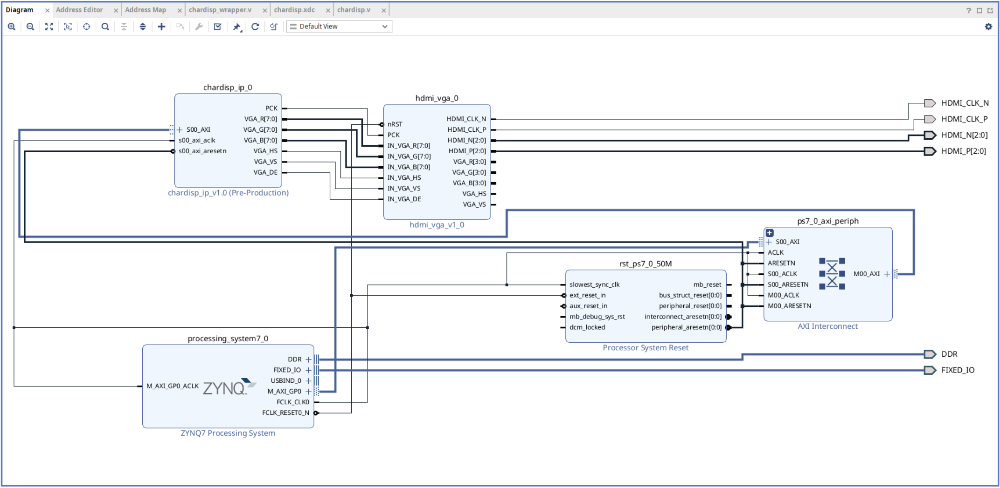

# chardisp_tutorial

This repository is a sample project that outputs characters to the screen.
The code in this repository is based on the project at this link below.

https://www.shuwasystem.co.jp/support/7980html/6326.html

This project is implemented so that bitstream generation and vitis project generation can be done all at once by simply executing the `make setup` command.

